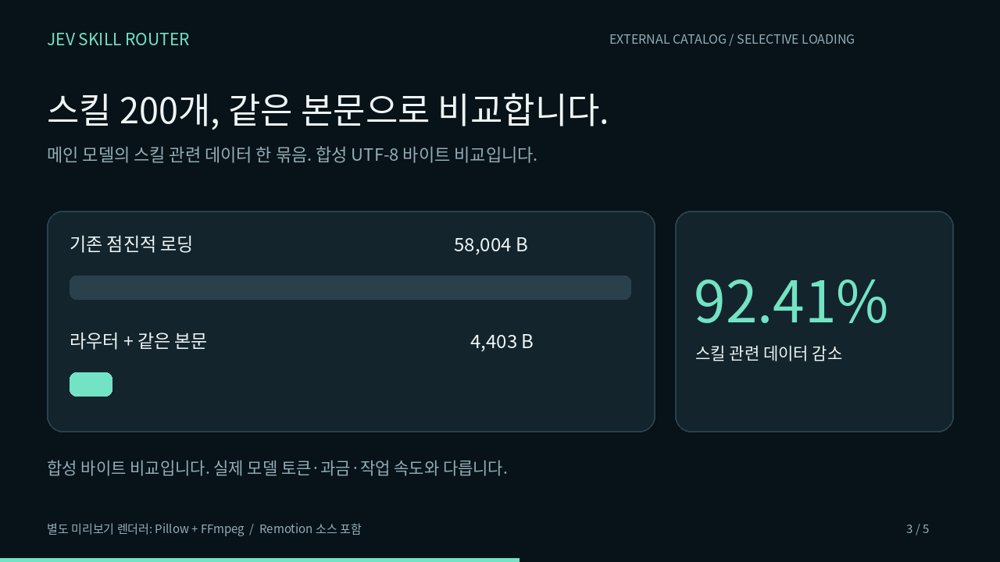
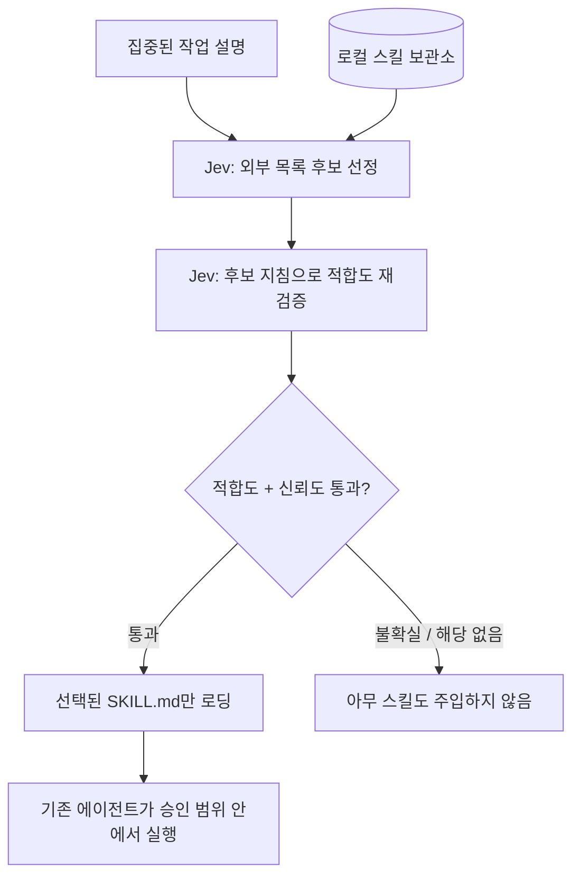

[English](README.md) | [**한국어**](README.ko.md)

# Jev Skill Router

**0.3.0 업데이트:** [주요 변경과 기존 사용자 적용 방법](docs/updates/v0.3.0.ko.md) · [변경 이력](CHANGELOG.ko.md)

### 스킬은 보관소에. 프롬프트는 필요한 것만.

**전체 스킬 목록을 메인 LLM 컨텍스트 밖에 두고, Jev가 고른 스킬만 불러옵니다.**

로컬 Python 서비스가 신뢰할 수 있는 `SKILL.md` 라이브러리를 읽고, [TypeSafe Jev](https://docs.typesafe.ai/introduction)로 적합한 스킬을 판단합니다. 메인 에이전트에는 **MCP 도구 하나**와 선택된 지침만 전달합니다. 실제 작업은 기존 에이전트가 자신의 도구와 승인 절차에 따라 수행합니다.

**Python 3.11+ · Claude Code / Codex / Cursor 연결 코드 · 영어·한국어 문서 · MIT**

[](https://github.com/himomohi/jev-skill-router/releases/download/v0.1.0/overview.ko.mp4)

[한국어 영상](https://github.com/himomohi/jev-skill-router/releases/download/v0.1.0/overview.ko.mp4) · [English video](https://github.com/himomohi/jev-skill-router/releases/download/v0.1.0/overview.en.mp4)

> **초기 버전:** 실제 Jev의 스킬 선택 품질과 각 클라이언트에서의 전체 사용 흐름은 아직 검증 중입니다.

## 무엇이 달라지나요?

일반적인 점진적 로딩 방식도 처음부터 모든 스킬 본문을 넣지는 않습니다. 대신 이름과 설명을 먼저 읽고 필요한 본문만 추가합니다. 다만 설명이 수백 개라면 그 목록 자체도 컨텍스트를 차지합니다. [Agent Skills 명세](https://agentskills.io/specification).

이 프로젝트는 본문뿐 아니라 **선택용 목록까지 메인 모델 밖으로 분리**합니다. 메인 모델에 필요한 정보는 대략 `고정된 라우터 인터페이스 + 선택된 스킬 본문`입니다. 전체 목록을 읽는 비용은 Jev 쪽으로 이동하며, 사라지는 것이 아닙니다.

**MCP만 추가하면 절감되지 않습니다.** 하네스가 기존 스킬 목록을 계속 읽지 않도록 기본 노출을 끄거나 사용자 관리 스킬을 별도 보관소로 이동해야 합니다. 이미 주입된 목록은 지울 수 없으므로 **새 세션**에서 확인하세요. 이 로컬 서버로 호스팅된 ChatGPT의 기본·플러그인 목록을 제거할 수는 없습니다.

## 가장 쉬운 시작

[최신 소스 ZIP](https://github.com/himomohi/jev-skill-router/archive/refs/heads/main.zip)을 내려받아 풀고 **Python 3.11 이상**이 설치된 상태에서 실행합니다.

```bash
python Install.py --offline
```

Windows에서는 `Install.cmd`, macOS에서는 `bash Install.command`를 실행해도 됩니다. 안내에 따라 스킬 폴더와 연결할 클라이언트를 선택하면 `~/.jev-skill-router/runtime`에 전용 환경을 구성하고 실행 경로를 출력합니다. 폴더를 지정하지 않으면 포함된 예제 스킬 6개를 앱 데이터 폴더로 복사합니다. 오프라인 데모라도 최초 의존성 설치에는 인터넷이 필요합니다.

**오프라인 모드는 키워드 기반 설치 확인용 데모입니다. Jev의 판단 결과가 아닙니다.**

uv를 사용한다면 저장소 폴더에서 다음과 같이 설치할 수 있습니다.

```bash
uv tool install '.[secure]'
jev-skills setup --root ./examples/skills --offline
jev-skills route "Debug a Python traceback and failing tests"
```

이 소스 배포본은 PyPI 게시를 전제로 하지 않습니다. `pip install jev-skill-router`로 공개 패키지를 설치하라는 안내가 아닙니다.

## 실제 스킬과 연결

CLI 설치 후 Codex 사용자 관리 스킬을 연결하는 예시입니다.

```bash
jev-skills setup --root ~/.agents/skills --client codex
jev-skills auth
jev-skills doctor --live

# 먼저 이동 계획을 확인합니다. --apply 없이는 이동하지 않습니다.
jev-skills park ~/.agents/skills
jev-skills park ~/.agents/skills --apply
```

`auth`는 지원되는 운영체제 보안 저장소에만 키를 저장합니다. macOS Keychain, Windows Credential Manager, 지원되는 Linux Secret Service를 사용하며, 평문 키 파일로 자동 전환하지 않습니다. 대신 **서버 환경변수** `TYPESAFE_API_KEY`를 사용할 수도 있습니다. `doctor --live`는 실제 API 요청으로 인증·응답을 확인합니다.

`park`는 사용자 관리 스킬의 직접 하위 폴더를 외부 보관소로 이동하고 설정과 복구 명세를 남깁니다. 라우터 연결용 스킬과 `.system`은 유지합니다. 플러그인 관리 목록, 중첩 컬렉션, 시스템 패키지, 스킬 간 외부 의존성까지 자동 처리하지는 않습니다. 이동 계획을 검토하고 백업한 다음 적용하세요. [설치·복구 안내](docs/INSTALLATION.md).

파일을 옮기지 않으려면 Codex의 `[[skills.config]]`로 기본 노출만 비활성화하고, 원래 폴더를 이 라우터에 등록하는 방법도 있습니다. [공식 설정](https://developers.openai.com/codex/skills).

| 연결 대상 | 설정 | 동작 |
| --- | --- | --- |
| Codex | `setup --root PATH --client codex` | MCP와 연결용 스킬 등록. 모델이 필요할 때 라우터 호출 |
| Cursor | `setup --root PATH --client cursor` | 기존 설정을 보존하며 MCP 추가. 필요할 때 호출 |
| Claude Code | `setup --root PATH --client claude` | MCP와 연결용 스킬 등록 |
| Claude 자동 사전 판단 | 위 Claude 설정에 `--hook` 추가 | 사용자 프롬프트 제출 전에 라우팅하고 선택된 지침 주입 |
| 직접 만든 하네스 | `Router.route(task)` 사용 | 모델 요청 직전에 어떤 지침을 넣을지 직접 제어 |

Codex·Cursor 연결은 모든 프롬프트를 강제 가로채는 기능이 아닙니다. Claude의 선택형 훅은 실제 사전 호출 경로를 제공하지만, 관련 스킬이 없는 요청에도 Jev 호출이 발생할 수 있습니다.

## 선택 과정



Jev가 스킬 설명으로 후보를 고른 뒤, 지침 일부를 읽고 작업에 맞는지 재확인합니다. 적합도와 신뢰도 기준을 통과한 후보가 없으면 스킬을 불러오지 않습니다. 작은 목록은 일반적으로 API 요청 2회가 필요하고, 큰 목록은 분할 처리하므로 호출이 늘어납니다. 독립된 배치는 기본 최대 3개까지 동시에 처리하며, 라우팅 시간 예산은 45초, 재시도를 포함한 요청 한도는 32회입니다. [설정 안내](docs/INSTALLATION.md#routing-limits).

기본값은 최대 1개이며, 복합 작업은 `max_skills`를 2~3으로 조정할 수 있습니다. 키 누락, API 실패, 낮은 적합도·신뢰도가 발생해도 다른 모델이나 키워드 판단으로 몰래 대체하지 않습니다.

## 얼마나 줄어드나요?

**합성 데이터로 로컬 재현한 UTF-8 바이트 비교입니다. 실제 모델 토큰 수가 아닙니다.** 선택된 같은 스킬을 로딩한 후, 메인 모델에 들어갈 **스킬 관련 데이터 한 묶음**만 비교했습니다. 전체 대화의 비용이나 속도 측정이 아닙니다.

| 스킬 수 | 기존: 목록 + 선택 본문 | 라우터: 인터페이스·호출·부가 정보 + 같은 본문 | 감소율 |
| ---: | ---: | ---: | ---: |
| 5 | 3,878 | 4,843 | -24.88% |
| 50 | 16,388 | 4,844 | 70.44% |
| 200 | 58,088 | 4,845 | 91.66% |
| 500 | 141,488 | 4,845 | 96.58% |

**스킬이 5개면 오히려 24.88% 늘어납니다.** 인터페이스를 추가하는 비용이 작은 목록보다 크기 때문입니다. 목록이 많고 설명이 길수록 유리하며, 이미 목록을 지연 검색하는 하네스나 대화·선택 본문이 큰 경우 전체 절감률은 달라집니다. 캐시된 목록의 비용이 낮을 수도 있어, 컨텍스트 감소가 비용·속도 개선을 보장하지는 않습니다.

```bash
# 내 라이브러리의 실제 파일로 계산: 모델 호출 없음
jev-skills benchmark
jev-skills benchmark --skill python-debug
```

[비교 방법과 한계](docs/BENCHMARKS.md)

## API 호출 전에 준비 상태 확인하기

```bash
jev-skills plan "Python 오류와 실패한 테스트를 디버깅해줘"
```

API 키 조회나 모델 호출 없이 순위 판단·후보 검증에 필요한 요청 수의 상한, 재시도 여유, 제한 초과 여부를 확인합니다. 실제 라우팅과 같은 사전 점검 코드를 사용합니다. `ready: true`는 로컬 제한을 통과했다는 뜻이며, 인증과 판단 정확도는 실제 API 평가가 필요합니다. [출력과 종료 코드](docs/INSTALLATION.md#check-a-route-before-spending).

긴 파일을 이어 읽을 때는 반환된 `next_offset`과 함께 `content_digest`를 `expected_digest`로 전달하세요. 0.3.0부터 이어 읽기에 이 값이 필요하며, 파일이 바뀌면 서로 다른 버전의 페이지가 섞이기 전에 중단합니다. 라우터 자신의 안내용 스킬은 선택 대상에서 제외하고, 같은 폴더를 가리키는 중복 경로도 통합합니다.

## 내 작업으로 검증하기

```bash
# 영어·한국어 24개 예제 검증: API 호출 없음
python scripts/evaluate_live.py --preflight
# 키 설정 후 실제 평가: 재시도까지 포함하여 최대 64회 요청
python scripts/evaluate_live.py --allow-live --max-requests 64
```

선택 정확도, 첫 요청·캐시 적중 시간, 실제 HTTP 요청 수와 보고된 사용량을 분리합니다. 최종 작업 성공률이나 메인 모델까지 합친 전체 비용을 측정했다고 표시하지 않습니다. [평가·비교 방법](docs/EVALUATION.md).

## 사용하기

클라이언트를 연결한 뒤 **새 세션**에서 스킬 라우터를 사용하도록 요청하세요.

> 스킬 라우터로 이 Python 오류를 디버깅할 지침을 찾아줘.

터미널에서도 스킬 선택 결과를 확인할 수 있습니다.

```bash
jev-skills route "Python 오류와 실패한 테스트를 디버깅해줘"
```

라우터가 선택된 지침과 관련 로컬 참조 문서를 반환하면, 에이전트가 이를 참고해 작업합니다. [도구 인터페이스](docs/ARCHITECTURE.md).

이 서버는 스크립트를 실행하거나 권한을 부여하지 않습니다. 기존 에이전트가 자신의 도구로 실제 작업을 수행합니다. 파일 읽기는 등록한 스킬 폴더 내부의 제한된 UTF-8 텍스트만 허용하고 상위 경로 접근·심볼릭 링크 등을 차단합니다. 악성 로컬 파일이나 신뢰할 수 없는 스킬 작성자를 완전히 격리하는 샌드박스는 아닙니다.

## 편의성과 주의점

하나의 외부 라이브러리를 여러 로컬 하네스에서 공유할 수 있습니다. Linux/macOS에서는 변경 없는 파일의 분석 결과를 재사용합니다. Windows는 NTFS/ReFS의 네이티브 변경 시각을 사용하며, 지원하지 않거나 조회에 실패하면 파일을 다시 읽습니다. 지속 실행되는 MCP 프로세스는 HTTP 연결과 짧은 메모리 캐시를 재사용합니다. 별도 CLI 실행이나 프롬프트마다 새로 뜨는 Claude 훅 프로세스 사이에는 캐시가 공유되지 않습니다.

키는 설정 JSON에 저장하지 않습니다. 단, 라이브 라우팅은 작업 설명, 스킬 설명, 후보 본문 일부를 TypeSafe로 전송합니다. 사내 기밀이나 비밀값을 넣지 마세요. [보안 범위](SECURITY.md).

[설치·복구 안내](docs/INSTALLATION.md) · [보안](SECURITY.md) · [MIT 라이선스](LICENSE)
