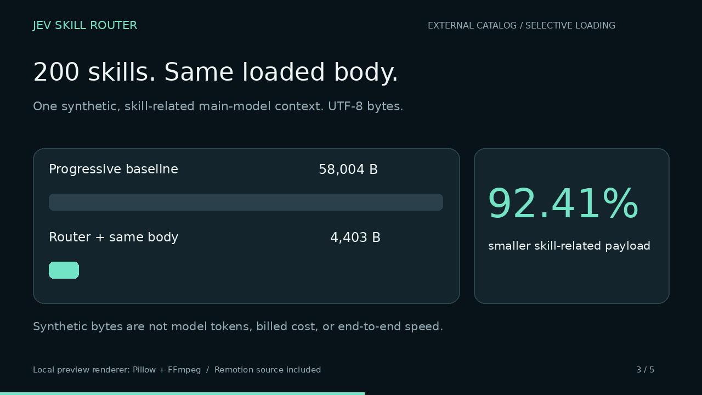
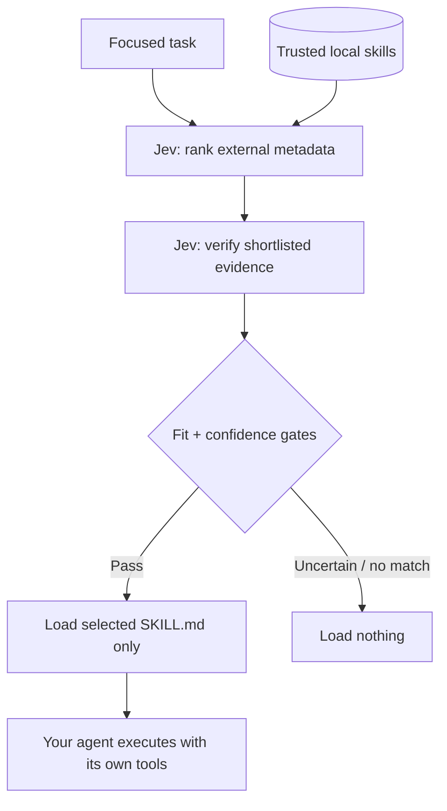

[**English**](README.md) | [한국어](README.ko.md)

# Jev Skill Router

### Your skills belong in a library. Not in every prompt.

**Keep the skill catalog outside your main LLM's context. Let Jev select what to load.**

A small, local Python service reads your trusted `SKILL.md` library, asks [TypeSafe Jev](https://docs.typesafe.ai/introduction) which skills actually fit, and returns only selected instructions through **one MCP tool**. Your existing agent still does the work, using its normal tools and approval rules.

**Python 3.11+ · Claude Code / Codex / Cursor adapters · English + Korean docs · MIT**

[](https://github.com/himomohi/jev-skill-router/releases/download/v0.1.0/overview.en.mp4)

[English Remotion video](https://github.com/himomohi/jev-skill-router/releases/download/v0.1.0/overview.en.mp4) · [한국어 영상](https://github.com/himomohi/jev-skill-router/releases/download/v0.1.0/overview.ko.mp4) · [Remotion source and rendering](video/README.md)

> **Verified:** 72 tests pass locally and the Linux/macOS/Windows CI matrix passes. English and Korean Remotion compositions rendered successfully in GitHub Actions. Videos explain the design; they are not live product recordings. Live Jev authentication, semantic routing quality, and actual host integration remain unverified. [Full evidence](docs/VALIDATION.md).

## Why another layer?

Progressive-disclosure harnesses usually load skill **names and descriptions**, not every full skill body, at startup. That is already better than loading everything, but an index containing hundreds of descriptions still consumes context. [Agent Skills specification](https://agentskills.io/specification).

This project moves the **selection inventory**, not merely the bodies, outside the main model. Its main-model footprint is approximately a fixed router interface plus the selected content: **O(1) + O(k loaded content)** rather than **O(N catalog metadata) + O(k loaded content)**. Jev still reads the metadata; the work moves to a separate decision service, not into thin air.

**Important: adding an MCP server alone does not hide native skills.** Disable their native exposure or explicitly move user-managed skill folders out of the harness's discovery paths. Start a **new session** to avoid carrying the old inventory in conversation history. Hosted ChatGPT's built-in/plugin inventory is not something this local server can remove.

## Start with the bundled examples

Download and extract the source ZIP from [v0.1.0](https://github.com/himomohi/jev-skill-router/releases/tag/v0.1.0), install **Python 3.11+**, then run:

```bash
python Install.py --offline
```

On Windows, open `Install.cmd`; on macOS, run `bash Install.command`. The guided installer asks for a skill root and client, creates a private environment in `~/.jev-skill-router/runtime`, and prints a stable CLI launcher. With no root, it copies six bundled example skills into the app's data directory. Network access is needed to install Python dependencies, even for the offline demo.

**Offline is an explicitly labeled keyword demonstration, not Jev.** It validates the installation and loading path without pretending to reproduce model behavior.

Already using uv? From the extracted repository:

```bash
uv tool install '.[secure]'
jev-skills setup --root ./examples/skills --offline
jev-skills route "Debug a Python traceback and failing tests"
```

No published PyPI package is assumed. `pip install jev-skill-router` is **not** the installation instruction for this source release.

## Connect your real library

A practical Codex setup, after installing the CLI:

```bash
jev-skills setup --root ~/.agents/skills --client codex
jev-skills auth
jev-skills doctor --live

# Inspect first. Nothing moves without --apply.
jev-skills park ~/.agents/skills
jev-skills park ~/.agents/skills --apply
```

`auth` stores the key only in a supported OS keychain: macOS Keychain, Windows Credential Manager, or a supported Linux Secret Service backend. It never falls back to a plaintext key file. Alternatively provide `TYPESAFE_API_KEY` in the **server's** environment. `doctor --live` makes a real API request; key presence by itself is not proof of authentication.

`park` preserves the router bridge and `.system` directory, moves direct user-managed skill folders to an external vault, updates router roots, and writes a restoration manifest. It does **not** manage plugin registries, nested collections, system packages, or cross-skill dependencies. Review the dry run and make a backup first. [Exposure and recovery](docs/INSTALLATION.md).

Prefer not to move files? Codex supports disabling local skills using `[[skills.config]]` entries; keep the original paths registered with this router. [Official local-skill configuration](https://developers.openai.com/codex/skills).

| Integration | Setup | Behavior |
| --- | --- | --- |
| Codex | `setup --root PATH --client codex` | MCP registration plus one bridge skill; the model chooses to call the router |
| Cursor | `setup --root PATH --client cursor` | Preserving merge into `~/.cursor/mcp.json`; on-demand MCP use |
| Claude Code | `setup --root PATH --client claude` | MCP registration plus a bridge skill |
| Claude pre-turn hook | Add `--hook` to Claude setup | Runs routing before each submitted user prompt; injects selected instructions |
| Your own harness | Import `Router`, call `.route(task)` | You control exactly when selected content enters the next model request |

Codex/Cursor MCP integration is **not** universal prompt interception. Claude's optional hook gives a concrete pre-turn path, but makes additional Jev calls even for prompts where nothing matches. It does not alter the host's permissions. Actual host installations remain unverified; generated configuration and hook payloads are tested locally.

## What happens on a request?



The first stage uses `Choice` with an explicit no-match option. The second asks independent `Noul` applicability and `Score` usefulness questions with the candidate's description and instruction excerpt. Code checks applicability, usefulness and the **Score answer's confidence** before loading anything.

Normal small catalogs need two logical Jev requests. Larger catalogs are sharded by both option count and serialized byte budget, so they need more. The implementation never compares Choice probabilities from unrelated shards as if they were one global distribution. It verifies each shard's shortlist against the same absolute rubric instead.

The default returns at most **one** skill; set `max_skills` to 2 or 3 for broader tasks. Low fit, low confidence, malformed API responses, missing keys, and API failures do not silently substitute another model or keyword routing.

## How much context can this save?

**Locally reproduced synthetic accounting. UTF-8 bytes, not model tokens.** These numbers measure only the skill-related serialized content in **one main-model context after loading the same selected skill**. They are not a whole-conversation or billing benchmark.

| Skills | Progressive baseline: metadata + selected body | Router: interface + call + bookkeeping + same body | Reduction |
| ---: | ---: | ---: | ---: |
| 5 | 3,794 | 4,401 | -16.00% |
| 50 | 16,304 | 4,402 | 73.00% |
| 200 | 58,004 | 4,403 | 92.41% |
| 500 | 141,404 | 4,403 | 96.89% |

Each synthetic description is 236 characters. The selected instructions are 2,144 characters and appear on **both** sides. The router side includes its actual static MCP tool schema and bootstrap. Generic host prompts, token framing, and Jev's separate input are excluded. The baseline's existing skill-reader tool schema is also omitted, conservatively.

**Five skills are worse, not better:** the extra interface outweighs a tiny inventory. The benefit grows with catalog size and description length. Large conversation histories, large selected bodies, already-deferred discovery, and repeated MCP calls change the overall result. Cached metadata can also be cheap; less context does not guarantee a smaller bill or faster task completion.

Reproduce the committed table, or measure your real library without calling any model:

```bash
python scripts/benchmark_context.py
jev-skills benchmark
jev-skills benchmark --skill python-debug
```

[Raw numbers and assumptions](docs/benchmark.json) · [Method, costs and limitations](docs/BENCHMARKS.md)

## A tiny tool surface

The MCP server exposes only `skill_router`:

```json
{"action":"route","task":"Review this SQL join for accidental row multiplication"}
```

The result includes selected content, confidence/fit values, model version, logical API calls, API-reported usage when available, and pagination. Follow a selected skill's local reference:

```json
{"action":"read","skill_id":"ID_FROM_ROUTE","path":"references/checklist.md","offset":0}
```

The router does **not** execute scripts, install arbitrary packages, modify application data, or grant permissions. Skills are read-only guidance; the agent's existing executor performs authorized actions. Reads are confined to trusted skill directories, block traversal and symlinks, and accept bounded UTF-8 text. This is not a sandbox for hostile local files or untrusted skill authors.

## Convenience without hidden behavior

One external library can serve several local harnesses. Descriptions are read in full during discovery; bodies are loaded only when selected. File hashes invalidate cached decisions when skill content changes. A persistent MCP process reuses its HTTP pool and has a small in-memory exact-request cache. Separate CLI invocations and Claude hook processes do **not** share that cache.

Configuration is local JSON, keys stay out of that JSON, and the provider endpoint is fixed to TypeSafe HTTPS. Live requests disclose focused task text, skill descriptions, and shortlisted excerpts to TypeSafe. Do not register confidential material without permission. [Security](SECURITY.md).

## Research, not borrowed performance claims

The official [TypeSafe skill-suggestion cookbook](https://docs.typesafe.ai/cookbooks/skill_suggestion) supports the two-stage pattern. Its published experiment keeps the main agent's **existing roster** and adds a suggestion; it is not a measurement of this project's context removal. We do not reuse its error rates as our own. Our stricter gating, sharding and inventory removal need a separate live evaluation.

A six-case English/Korean starter corpus and an opt-in live evaluator are included:

```bash
python scripts/evaluate_live.py examples/evaluation.jsonl --allow-live
```

This sends data to TypeSafe and incurs API usage. Expand the small starter set with real ambiguous and no-match cases before tuning thresholds. [Research notes](docs/RESEARCH.md).

## Develop, render, publish

```bash
python -m pip install '.[dev]'
python -m pytest -q

cd video
npm ci
npm run typecheck
npm run render
```

The Remotion project includes a verified dependency lockfile. Use `npm ci` for reproducible installation; dependency-backed TypeScript checking and both language renders passed in GitHub Actions. See [video instructions](video/README.md) for renderer boundaries and the manual-only GitHub Actions render job.

To create a **new** repository and upload included MP4s as release assets, review the bundle, install Git + GitHub CLI, sign in with `gh auth login`, configure your Git author identity, then run:

```bash
python scripts/publish_github.py --public --release
```

It creates `<your-authenticated-login>/jev-skill-router`, commits the reviewed source, pushes it, and publishes a `v0.1.0` release. It refuses an existing repository or remote and never force-pushes. This project is published at [himomohi/jev-skill-router](https://github.com/himomohi/jev-skill-router); the helper is for creating a separate new repository. [Publishing details](docs/PUBLISHING.md).

[Installation](docs/INSTALLATION.md) · [Architecture](docs/ARCHITECTURE.md) · [Validation](docs/VALIDATION.md) · [Contributing](CONTRIBUTING.md) · [License](LICENSE)
